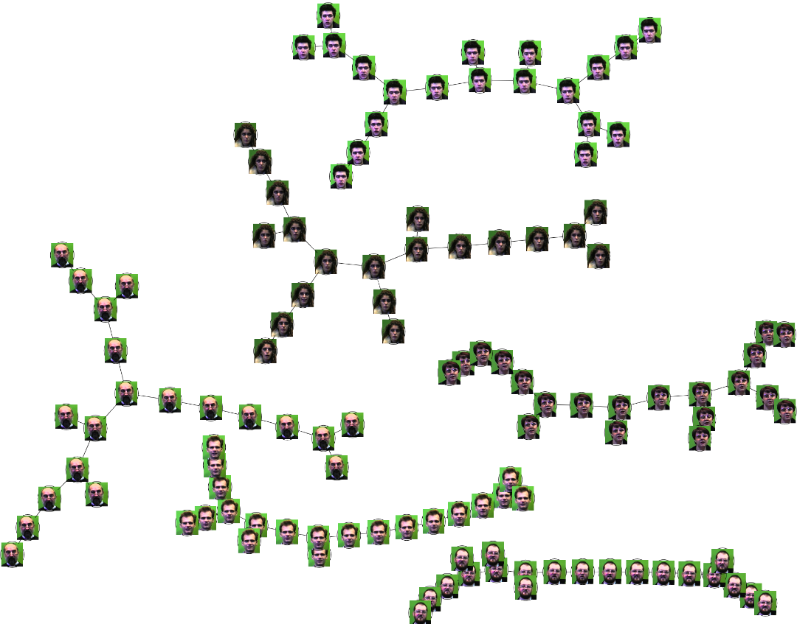

Implemented Fibonacci heap structure to cluster faces images by similarity.
#### Results

### Files
Arista.h and NodoF.h : data structure with templates

Fibonacci_Heap.h : Fibonacci heap algorithms
	- generatePDF

VectorCaracteristico.h : calculate the distances between the nodes. Have different type of distances: euclidean, manhattan and chebyshev distance. 

The results show the same clusteres for the different types of distances used.